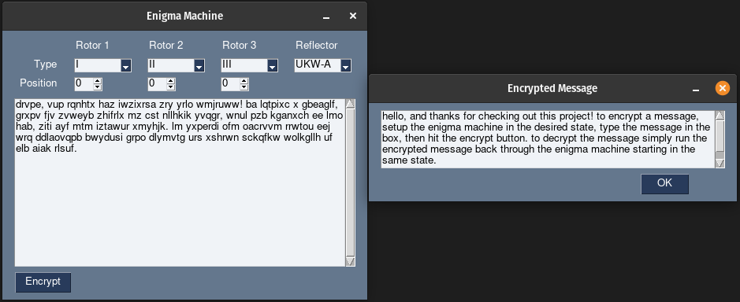

# Enigma Machine
An Enigma machine library written in C++, called from Python using [pybind11][PB11] and [cppimport][CPPI] to wrap and build the library. Encrypted messages can be decrypted by running them through the Enigma machine starting in the same state.

<p align="center">
    
</p>

## Introduction
Hello, and thanks for checking out this project! To encrypt a message, setup the Enigma machine in the desired state, type the message in the box, then hit the encrypt button. To decrypt the message simply run the encrypted message back through the Enigma machine starting in the same state. The message to encrypt can contain any characters, however only letters of the alphabet (a-z) will be run through the Enigma machine with the other characters preserved in-place. The wiring for the rotors and reflectors has been copied from the real [Enigma I][EI] machine. The rotor/reflector/plugboard configurations of the Enigma machine can be changed in the constants.cpp file, however this is not recommended as errors can lead to the Enigma machine not working correctly. If you do decide to change the configuration, ensure that each letter only appears once.

### Be careful when changing the configuration in the constants.cpp file as errors can lead to the Enigma machine not working correctly.

## Motivation
This project was used as a learning experience for interfacing with C++ code from within Python, as well as a learning experience of the different types of build systems available for C++. The Enigma machine library was initially built using CMake, but it has since been converted to using cppimport with pybind11 to build the Python module during execution.

## Requirements
* A C++ compiler such as [GCC][GCC] or [MSVC][MSVC]
* A build system such as [GNU Make][Make]
* Tkinter

Tkinter should already be installed on Windows/macOS. To install on Ubuntu based Linux distributions
```sh
sudo apt install python3-tk
```
* Python 3

Required Python libraries can be installed via ``pip3``
```sh
pip3 install -r requirements.txt
```

## Usage
To get started ensure that all the requirements are installed then simply run ``main.py`` in the ``src`` directory. Python should build the enigmaWrapper module for you using cppimport and pybind11. This can take a couple seconds for the first use as everything is built. Future uses should be instant unless something gets changed in the C++ source files, as the module will have to be rebuilt.
```sh
python3 src/main.py
```

## License
Distributed under the GNU GPLv3 license. See ``LICENSE.txt`` for more information.

[PB11]: https://pybind11.readthedocs.io/en/stable/index.html
[CPPI]: https://github.com/tbenthompson/cppimport
[EI]: https://www.cryptomuseum.com/crypto/enigma/i/index.htm 
[GCC]: https://www.gnu.org/software/gcc/
[MSVC]: https://visualstudio.microsoft.com/vs/features/cplusplus/
[Make]: https://www.gnu.org/software/make/
